# 👩‍👦‍👦 ForSeason

팀장 : 김지영 
팀원 : 조민수, 설재경
개발 기간은 2023.01.02 ~ 2023.02.17 (총 46일)  
주제 : 온라인 옷 쇼핑몰

# 개요  
- 시연 영상 : http://youtube.com/

# 🎩 개발 환경 / 시스템 구성

 | 항목 | 내용 |
 | --- | ---|
 | 언어 | Java, Python, HTML/CSS, JavaScript |
 | 서버 | NaverCloudPlatForm, Apache Tomcat |
 | 프레임워크 | SpirngBoot, Mybatis, Thymeleaf |
 | DB | MySQL |
 | IDE | Eclipse, Intellij, GitBash, MySQL Workbench |
 | 협업 도구 | Git-hub, Notion, Zoom, Discord, KakaoTalk |
 | API 또는 라이브러리 | Google :  EMAIL  Kakao : Login, Map   Naver : Login, Chatbot   Iamport : KakaoPay   공공데이터 : Weather   |
 | VERSION | Java JDK : 11.0.17   Maven : 2.7.7   Servlet : 3.0.1   Mysql : 8.0.31   Intellij : 2022.3.2 (Ultimate Edition)   Eclipse IDE : 2020-12 (4.18.0)|            

## ERD 구조 

-  https://www.erdcloud.com/d/7PDjo2FzznEwfmLCZ

# 🤓 설치 방법
프로젝트를 로컬 환경에서 실행하는 방법을 설명하는 섹션입니다. 

1. 저장소를 클론합니다.
2. 해당 프로젝트를 IDE(예: Eclipse, Intellij 등)에서 엽니다.
3. DB 설정 파일(application.properties)에서 DB 정보를 수정합니다.  
 Intellij : mybatis.mapper-locations=classpath:mybatis/*.xml  
 Eclipse  : mybatis.mapper-locations=com/admin/mybatis/*.xml   
4. Maven을 이용하여 빌드하고 실행합니다.

# 🧐 사용 방법
주의 : 꼭 실행전에 해당 라이브러리를 사용하기 위해선 아래 API를 등록 후 키값과 Redirect URL 를 수정 해주셔야 합니다.  
Kakao API 등록 : https://developers.kakao.com/docs/latest/ko/index  
Naver API 등록 : https://developers.naver.com/docs/common/openapiguide/appconf.md#api-%EC%84%A4%EC%A0%95 
Google Email API 등록 : https://cloud.google.com/appengine/docs/standard/java/mail/sending-mail-with-mail-api?hl=ko 
Iamport API 등록 : https://portone.gitbook.io/docs/  

User Detail View

### Login Page
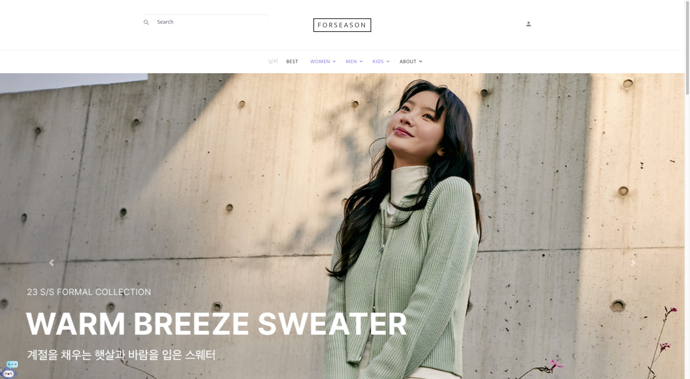 
### Main Page 
 
### Chart Click Event
 
 
### Category Page
 
### Item Add Click 
 
### UserPush Coupon And Mail Page
 
### Discount Click
 
### QnA Page - Reply Page
  
### Datail Click
 

 

Admin Detail View 

### Login Page
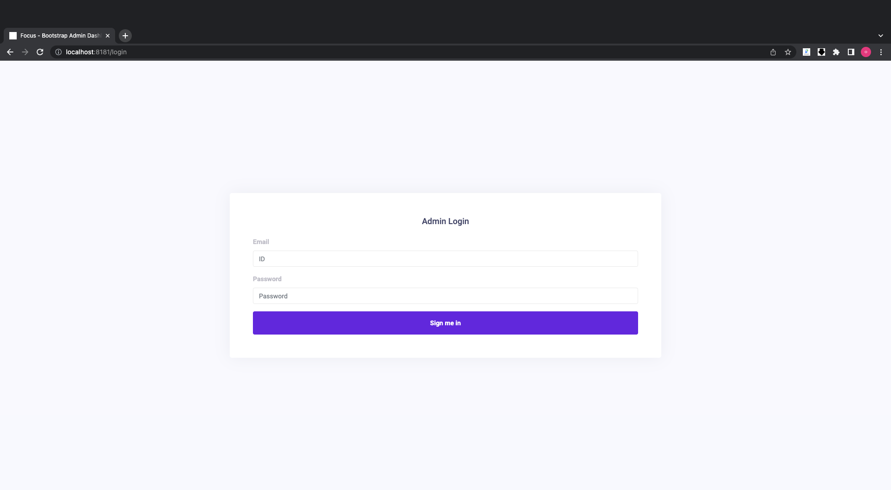 
### Main Page 
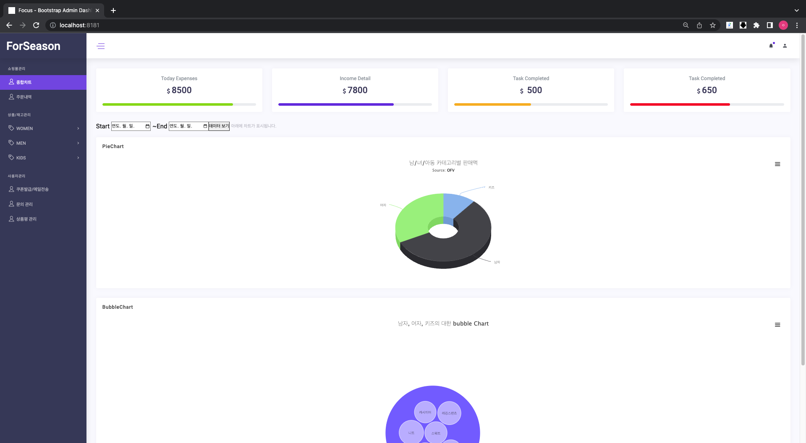 
### Chart Click Event
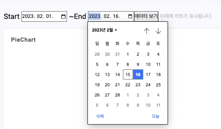 
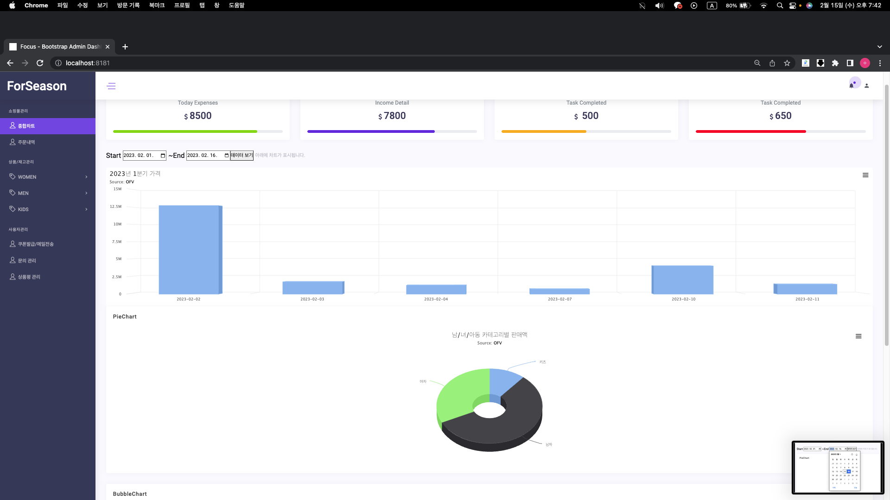 
### Category Page
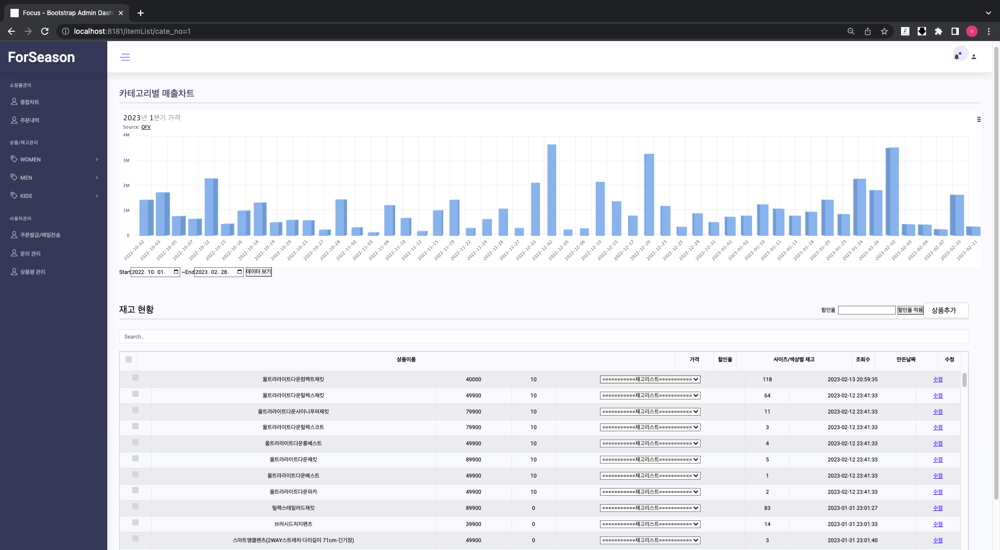 
### Item Add Click 
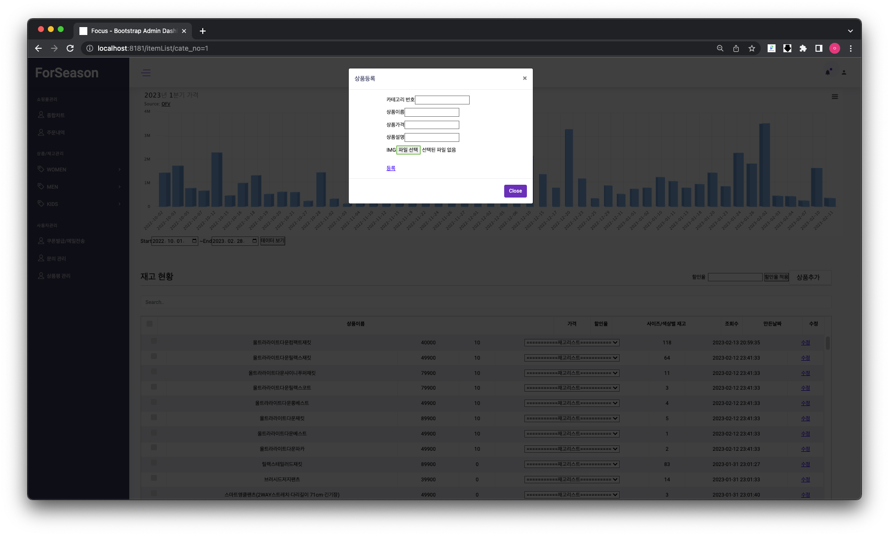 
### UserPush Coupon And Mail Page
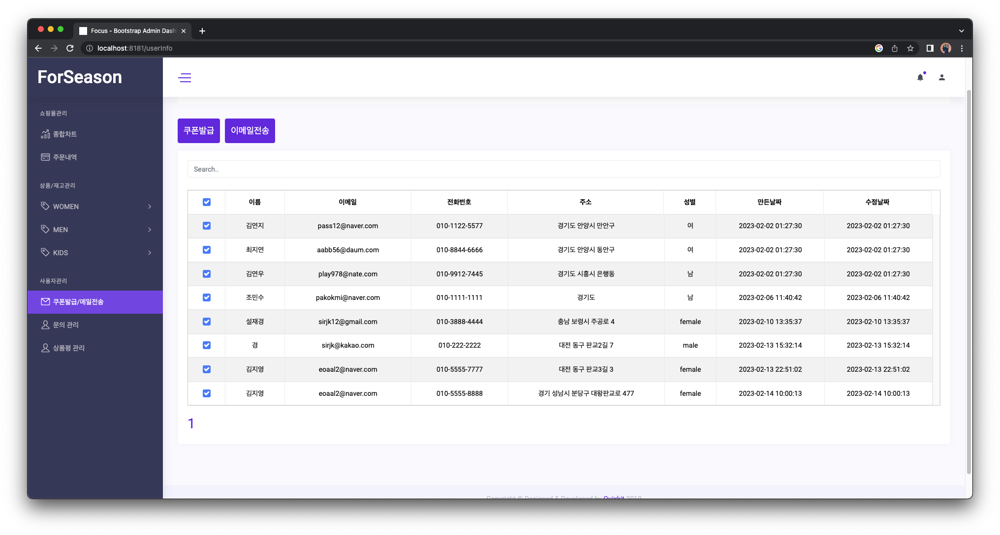 
### Discount Click
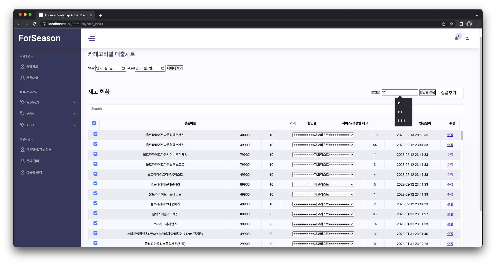 
### QnA Page - Reply Page
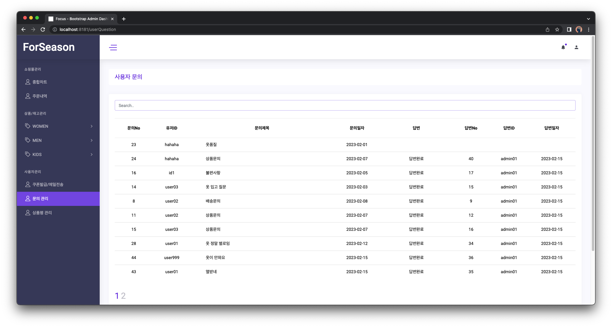 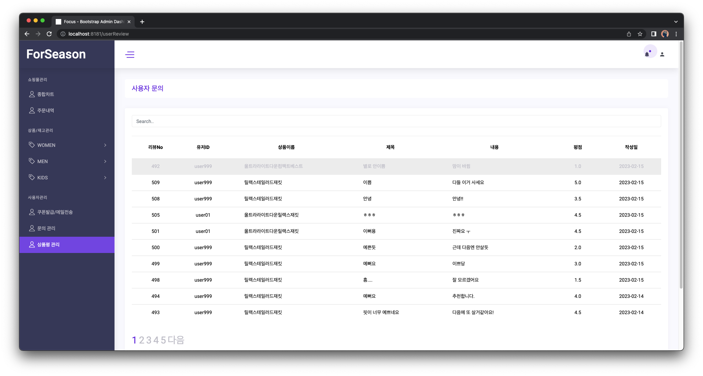 
### Datail Click
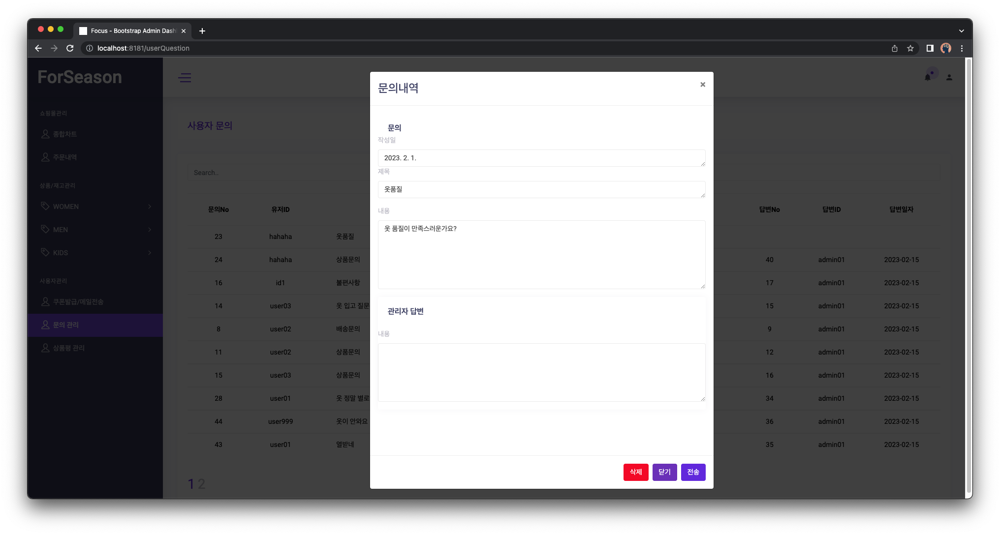 

# 👍 WBS

# 프로젝트 과정 

김지영 :  
조민수 : 파이썬을 이용한 이미지 크롤링을 통해 상품 카테고리 확장  
설재경 :  

# 테스트 및 배포 

# 기여 방법

프로젝트에 기여하는 방법을 설명하는 섹션입니다. 아래와 같은 절차를 따릅니다.

1. 이 저장소를 포크합니다.
2. 새로운 브랜치를 만들어 개선 작업을 합니다.
3. 변경 사항을 커밋합니다.
4. 새로운 풀 리퀘스트를 생성합니다.

# 라이선스

프로젝트에 대한 라이선스 정보를 적습니다. 

[라이선스 정보]

# 참고자료
Intellij Mybatis -  https://kyun2.tistory.com/69  
Selenium - https://wikidocs.net/177133  

# 트러블 슈팅 
