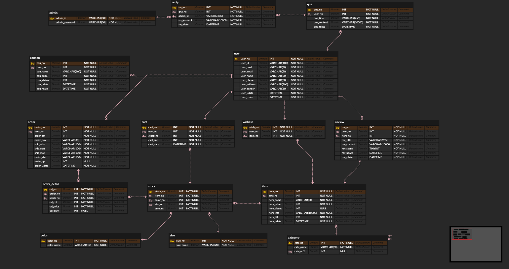
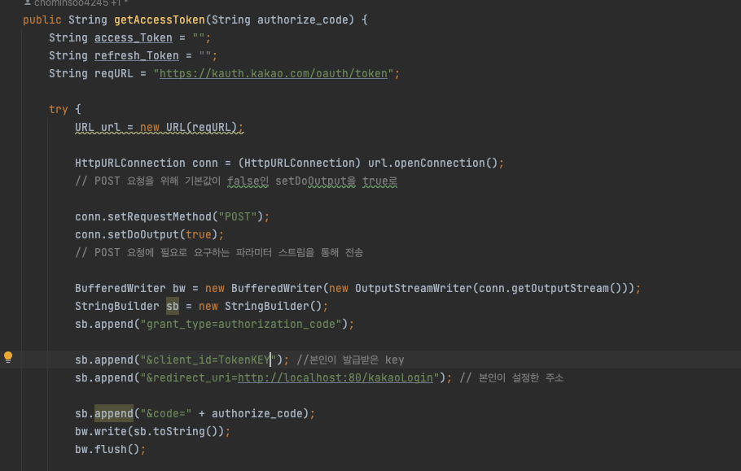
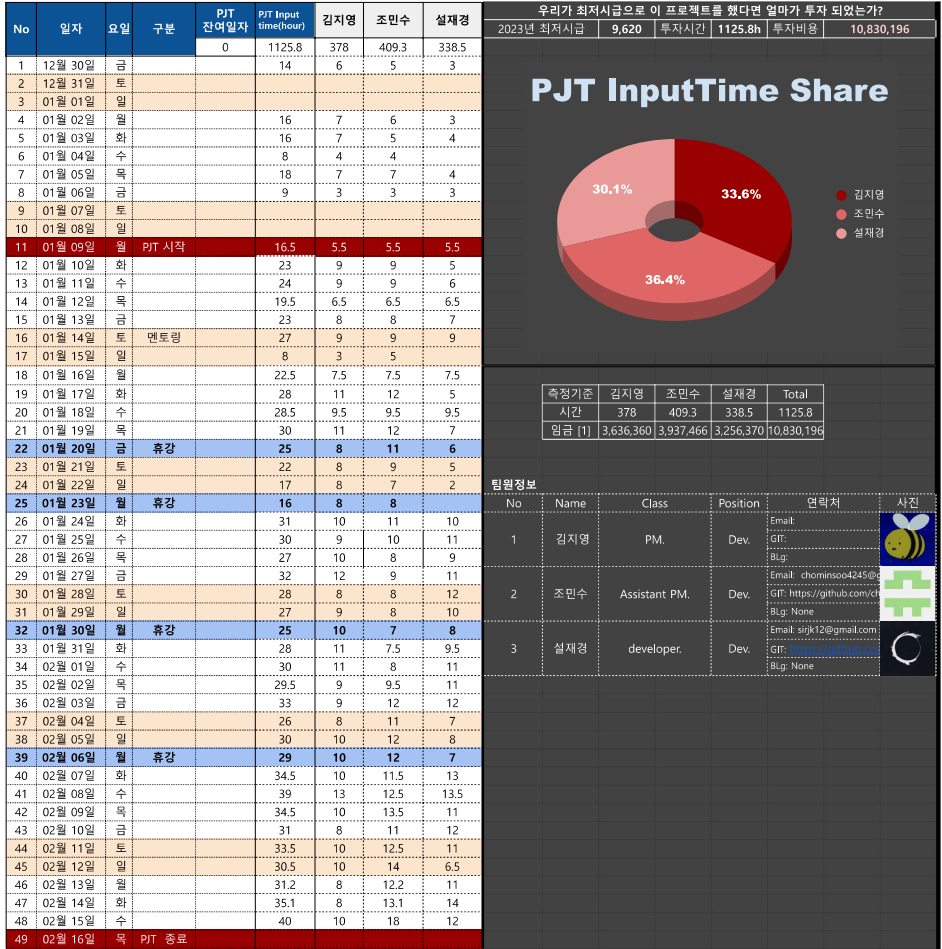

# 👩‍👦‍👦 ForSeason
  
팀장 : 김지영  
팀원 : 조민수, 설재경  
개발 기간 :  2023.01.02 ~ 2023.02.17 (ì´ 46일)  
주제 : EIMS 기능을 도입한 패션 리테일 세일즈 마켓  

# 개요
서버 오픈 2023.02.01 ~ 2023.02.17
  🛒 [ForSeason](http://27.96.130.136:80)   🛒 [Admin_ForSeason](http://27.96.130.136:8181)   💻 [홈페이지 시연 영상](https://youtu.be/oJsMnl8CGT0)   [PPT 시연 영상](https://www.youtube.com/watch?v=Qggjdsd8aVY&feature=youtu.be)

# 🗒️ 개발 목적 
##  기획 목적
1. 무난히 채택되는 웹쇼핑몰이라는 주제 우리만의 깊이로 담아냄
2. 백앤드의 영역에서 기술적인 부분에 가장 효과적인 증명을 찾을 것

## 주제 선정
 1. 성별 > 옷분류 > 세부 옷분류 > 상품 > 색상 > size 카테고리를 단계별 정의, 깊은  multilayer 구현 
 2. multilayer 구현으로 통한 광범위한 데이터 재고 시스템 구현(출고, 입고)
 3. 상품 데이터가 광범위하게 증가에도, 관리용이한 유저경험 서비스

# 🎩 개발 환경 / 시스템 구성
| 항목 | 내용                                                                                                                   |
 |----------------------------------------------------------------------------------------------------------------------| ---|
| 언어 | Java(11.0.17), Python(3.11.2), HTML/CSS, JavaScript                                                                  |
| 서버 | NaverCloudPlatForm,  Apache Tomcat (Windows 9.0.69, Linux 8.5.27)                                                 |
| 프레임워크 | SpirngBoot(2.7.7), Mybatis(2.3.0), Thymeleaf, Selenium (4.0.0 Alpha), Servlet(3.0.1)                                 |
| DB | MySQL Workbench(8.0.31)                                                                                              |
| IDE | Eclipse IDE 2020-12 (4.18.0), Intellij 2022.3.2 (Ultimate Edition), GitBash, PyCharm(2022.3)                         |
| 협업 도구 | Git-hub, Notion, Zoom, Discord, KakaoTalk                                                                            |
| API 또는 라이브러리 | Google :  EMAIL  Kakao : Login, Map   Naver : Login, Chatbot   Iamport : KakaoPay   공공데이터 : Weather   |
|

# ERD 구조 

view images

[ERD](https://www.erdcloud.com/d/7PDjo2FzznEwfmLCZ)
# UI

view images

  
 

# 🤓 설치 방법
1. 깃 클라이언트를 설치합니다.
2. 이 저장소를 clone합니다. `$ git clone https://github.com/5group/ForSeason.git`
3. 프로젝트 디렉토리로 이동합니다. `$ cd ForSeason`,`$ cd Admin_ForSeason`
4. 필요한 라이브러리를 설치합니다. `$ npm install`
5. 프로젝트를 실행합니다. `$ npm start`

# 🧐 사용 방법
주의 : 꼭 실행전에 해당 라이브러리를 사용하기 위해선 아래 API를 등록 후 발급받은 키와 해당 Redirect URL 를 수정 해주셔야 합니다.  
1. [Kakao API 등록](https://developers.kakao.com/docs/latest/ko/index) 
2. [Naver API 등록](https://developers.naver.com/docs/common/openapiguide/appconf.md#api-%EC%84%A4%EC%A0%95) 
3. [Naver CLOVA ChatbotAPI](https://www.ncloud.com/product/aiService/chatbot) 
4. [Google Email API 등록](https://cloud.google.com/appengine/docs/standard/java/mail/sending-mail-with-mail-api?hl=ko) 
5. [Iamport API 등록](https://portone.gitbook.io/docs/) 
6. [Weather API 등록](https://blog.codef.io/weather_api/)  

View Setting Images

## application.properties 

view images

- 위치 : src/main/resources/templates/application.properties  
 * Intellij : mybatis.mapper-locations=classpath:mybatis/*.xml  
 * Eclipse  : mybatis.mapper-locations=com/admin/mybatis/*.xml  

 
## KAKAO Login, Map API
- 위치 :  /src/main/service/KakaoService.class  
기입사항 : REST KEY 

view images

- 위치 : src/main/resources/templates/main.html  
 기입사항 : Javascript KEY  

view images

 

## NAVER Login API
- 위치 : /src/main/service/naverService.class  
기입사항 : REST KEY 

view images

## NAVER CLOVA CHATBOT API
- 위치 : /src/main/frame/ChatBotUtil.class  
기입사항 : REST KEY  

view images

 
 

## Weather API
- 위치 : /src/main/controller/DataController.class  
기입사항 : 일반 인증키 

view images

# 기여 방법

1. 이 저장소를 포크합니다.
2. 새로운 브랜치를 만들어 개선 작업을 합니다.
3. 변경 사항을 커밋합니다.
4. 새로운 풀 리퀘스트를 생성합니다.

# 👍 WBS
[WBS Link](https://docs.google.com/spreadsheets/d/1R_241JtF-_GycNwjWgMNh7y730_RZhkuIOJwmjfNur4/edit#gid=376896609)

view images

# 🙋🏻 웹 구성요소

User Detail View

## 🌈USER
 
### 🌟 HOME Page 🌟

### 🌟 BEST Page 🌟

### 🌟 MAP Page 🌟

### 🌟 Login Page 🌟

### 🌟 Sign UP 🌟
 
 
### 🌟 Order Page 🌟

### 🌟 Order Detail Page 🌟
 
### 🌟 WishList Page 🌟

### 🌟 Review Page 🌟
 

### 🌟 Coupon Page 🌟

### 🌟 Qna Page 🌟
 

### 🌟 Check Password Page 🌟

### 🌟 UserInfo Change 🌟

### 🌟 UserInfo Delete 🌟
 

### 🌟 ItemDetail Wish Add Page 🌟
 
### 🌟 ItemSearch Page 🌟
 
### 🌟 order Add Page 🌟
 

 

Admin Detail View 

## ❄️ ADMIN

### ☃️ Login Page ☃️
 
### ☃️ Main Page ☃️
 
### ☃️ Chart Day Click ☃️

#### 🌫️ Before 🌫️
 
### ☃️ Category Page ☃️
 
### ☃️ Item Add Click ☃️ 
 
### ☃️ UserPush Coupon And Mail Page ☃️
 
### ☃️ Discount Click ☃️
 
### ☃️ QnA Page ☃️

### ☃️ Reply Page ☃️
 
### ☃️ Datail Click ☃️ 
 

# 👩🏻‍💻 프로젝트 임무분담 

<table>
  <tr>
    <td>이름</td><td>Part Table</td><td>기능</td>
  </tr>
  <tr>
    <td rowspan="5">김지영</td><td>카테고리</td><td>CRUD, (대-중-소)분류 카테고리, 카테고리 별 상품리스트 구현 </td>
  </tr>
  <tr>
    <td>상품</td><td>상품 검색, 정렬기능, 카테고리 분류, 검색, 정렬 결과에 따른 페이징,  상품 상세페이지, 상품 색상 클릭시 이미지 변경, 베스트 아이템, 위시리스트 기능 구현 </td>
  </tr>
  <tr>
    <td>재고</td><td>색상 CRUD, 사이즈 CRUD, 색상별 사이즈 불러오기 기능 구현    </td>
  </tr>
  <tr>
    <td>사용자 UI</td><td>메인페이지, 로그인, 회원가입페이지, 상품리스트, 상품상세페이지, 마이페이지, 위시리스트   </td>
  </tr>
  <tr>
    <td>관리자 UI</td><td>메인페이지, 로그인페이지, 주문내역페이지, 상품/재고관리 페이지, 쿠폰/메일발송 페이지 </td>
  </tr>
  <tr>
    <td rowspan="11">조민수</td><td>회원</td><td>CRUD, 회원 생성, 회원 탈퇴, 아이디/비밀번호 찾기, 정보 변경 및 패스워드 변경,  
          Kakao Login, Kakao Logout, 주문 내역 조회, 주문상세내역 조회, 쿠폰 조회,  
          회원가입시 이벤트성 쿠폰 발급, 회원 조회, 패스워드 암호화, 패스워드 이메일발송 암호화 구현
    </td>
  </tr>
  <tr>
    <td>주문</td><td>CRUD, 카카오 페이 결제 구현</td>
  </tr>
  <tr>
    <td>장바구니</td><td>CRUD, 장바구니 페이지 구현, 결제시 해당 장바구니 제거 구현</td>
  </tr>
  <tr>
    <td>재고</td><td>CRUD, 주문 결제 시 재고 갯수 차감, 재고 조회, 재고 수정 추가, 페이지 구현</td>
  </tr>
  <tr>
    <td>상품</td><td>CRUD, BeautifulSoup, Selenium을 이용한 유니클로 상품 크롤링,  상품데이터 수집 후 상품 자동등록 시스템, 상품 등록 및 가격 수정 구현</td>
  </tr>
  <tr>
    <td>차트</td><td>주문 내역 데이터를 이용한  bubbleChart, Line Chart, Pie Chart 구현</td>
  </tr>
  <tr>
    <td>admin</td><td>Login 구현</td>
  </tr>
  <tr>
    <td>챗봇</td><td>Naver CLOVA ChatBot 비동기식 데이터 통신 구현</td>
  </tr>
  <tr>
    <td>날씨</td><td>현재날씨, 온도에 맞는 상품추천 구현</td>
  </tr>
  <tr>
    <td>기타</td><td>우편 번호 API 기능 구현,  카테고리별 이미지 데이터 자동수집 및 자동 등록 기능 구현 </td>
  </tr>
  <tr>
    <td>README</td><td>README 제작, 이미지 구현</td>
  </tr>

  <tr>
    <td rowspan="6">설재경</td><td>회원</td><td>Main Page 리뷰 / 문의, 데이터 생성 / 삭제 고도화 구현</td>
  </tr>
  <tr>
    <td>상품</td><td>상품 디테일과 리뷰 디테일, 게시판, 별점 및 조회수 표시,   오름차순~내림차순 조회, 실시간 리뷰 조회, 리뷰 관리 구현</td>
  </tr>
  <tr>
    <td>VIEW</td><td>BootStrap 을 이용한 페이징 및 데이터 팝업 - 모달창, User/Admin Reply&Review 구현</td>
  </tr>
  <tr>
    <td>WBS</td><td>WBS제작 및 담당 관리</td>
  </tr>
  <tr>
    <td>NCP</td><td>NCP 서버 환경 구축</td>
  </tr>
  <tr>
    <td>최종 발표 준비</td><td>PPT 제작, 동영상 편집 & 업로드, Script 작성  </td>
  </tr>
</table>

# 🔦 참고자료
[Intellij Mybatis](https://kyun2.tistory.com/69)  
[Selenium](https://wikidocs.net/177133)  
[Putty](https://investechnews.com/2021/06/15/mac-putty-install-error/) 
[war 배포](https://baboototo.tistory.com/m/29)
# ⚒️트러블 슈팅⚒️ 

- 기획단계 결정 지연
  * 문제: 프로젝트 기획 단계에서 결정 지연이 발생하여 개발 일정이 밀렸습니다.
  * 해결: 프로젝트 관련 회의에서 기획 단계 결정이 우선적으로 이루어지도록 다음과 같은 조치를 취했습니다.
     * 회의 참석 인원에 대한 사전 안내 및 참석 요청
     * 회의 일정 및 안건 미리 공지
     * 회의록 작성 및 공유

- ERD 작업간에 긴 시간에 소요됨
  * 문제: ERD 작업이 예상보다 오랜 시간이 소요되었습니다.
  * 해결: ERD 작업을 효율적으로 진행하기 위해 다음과 같은 조치를 취했습니다.
    * ERD 작업 전 미리 관련 자료 수집 및 정리
    * 작업을 시작하기 전 관련 인원과 논의하여 작업 방향성 확립
    * ERD 작업 중 발생한 이슈는 빠르게 공유하여 해결

 
- NCP 테스트 오류, 무한로딩 이미지 mapper 오류 발생
  * 문제: NCP 테스트 시 오류가 발생하였고, 무한로딩 이미지 mapper 오류도 발생하였습니다.
  * 해결: 롤백 주소로 변환 후 오류가 발생하지 않는 것으로 확인되었으므로, 다음과 같은 조치를 취했습니다.
    * 롤백 주소로 변환 후 테스트 및 오류 해결 서버 상태 모니터링을 통해 유사한 이슈 발생 시 빠르게 대처

- 깃 충돌 오류 및 프로젝트 공유 오류 발생
  * 문제: 깃 충돌 오류가 발생하고 프로젝트 공유간의 오류가 발생하여, application.properties와 pom.xml 주소 오류를 확인해야 했습니다.
  * 해결: Git 충돌 방지를 위해 해당 데이터를 제외한 git push를 시도하였으며, 이후 application.properties와 pom.xml 경로 오류를 확인하여 수정하였습니다.
  

- 로그인 API 사용시 Paging Error 발생
  * 문제: 로그인 API를 사용할 때 Paging Error가 발생하였습니다.
  * 해결: Redirect URL이 정상적이지 않았기 때문에 해당 주소를 수정하였고, 이후 정상적으로 처리되었습니다.
  

- 결제 진행시 할인율이 적용되지 않는 오류 발생
  * 문제: 결제 진행시 할인율이 적용되지 않는 오류가 발생하였습니다.
  * 해결: 해당 Database 코드가 잘못되어 있었기 때문에 Mysql을 수정하였고, 이후 정상적으로 처리되었습니다. 

- 아이디/패스워드 찾기 버그 발생
  * 문제: 아이디/패스워드 찾기 버그가 발생하였습니다.
  * 해결: 이메일 Service에서 코드가 정상적으로 넘어가지 않는 문제를 발견하여 수정하였고, 이후 정상적으로 처리되었습니다.

